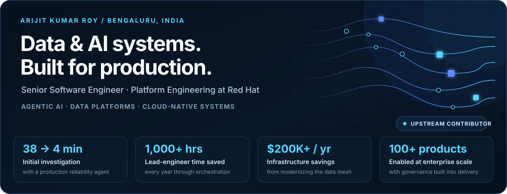
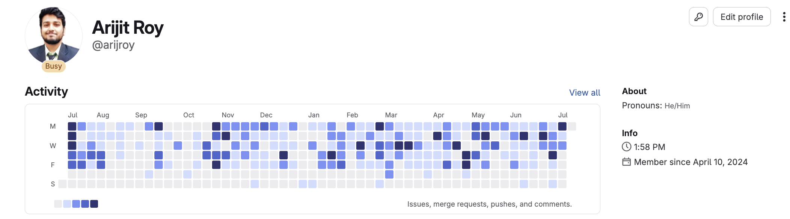

<!-- markdownlint-disable MD033 MD041 -->



<p align="center">
  <a href="https://arijitroy003.github.io"><strong>Portfolio</strong></a>
  &nbsp;·&nbsp;
  <a href="https://www.linkedin.com/in/sudo-kill"><strong>LinkedIn</strong></a>
  &nbsp;·&nbsp;
  <a href="mailto:arijitroy003@gmail.com"><strong>Email</strong></a>
</p>

I turn expensive, ambiguous data operations into dependable production systems: agents that shorten incident response, platforms that make governed data self-service, and automation that gives senior engineers their time back.

Today I am a **Senior Software Engineer in Data & AI Platform Engineering at [Red Hat](https://www.redhat.com)**. Across eight years, I have built for regulated enterprise platforms and consumer products serving up to **120M+ users** and **500M events per day**.

## What I build

### 01 / Agentic AI

Production MCP and LangChain systems for investigation, release orchestration, metadata intelligence, and operational decision support—with observability and human handoffs designed in.

### 02 / Data platforms

Self-service data products on Snowflake, Databricks, dbt, Spark, and Delta Lake, with governance, quality, lineage, and cost controls embedded in the paved road.

### 03 / Platform engineering

Cloud-native control planes and developer workflows built with Python, Go, Kubernetes, OpenShift, GitOps, Terraform, and pragmatic automation.

## Systems I have shipped

| System | What changed | Scale and stack |
| --- | --- | --- |
| **Data Reliability Agent** | Automated first-line pipeline triage and reduced initial investigation from **~38 minutes to ~4 minutes**. | MCP, LangChain, OpenShift, Langfuse |
| **Release Assistant** | Orchestrated governed releases and saved **1,000+ lead-engineer hours annually**. | Python, GitOps, Snowflake, 150+ compliant data products |
| **Self-service Data Mesh** | Replaced legacy Redshift/Starburst paths and reduced infrastructure cost by **$200K+/year**. | OpenShift, dbt, Snowflake, Kubernetes |
| **Consumer AI at scale** | Built GenAI search, recommendations, and conversational systems for Tata Neu and Beem. | 120M+ users, 500M events/day, 12 Indic languages |

## Open source, upstream

I contribute correctness fixes, security hardening, CI improvements, typing support, tests, and documentation across the data and AI ecosystem.

<!-- open-source starts -->
**62 merged upstream pull requests** across **30 repositories**, including the DuckDB, vLLM, dbt Labs, Red Hat, llm-d, Apache, and LangChain communities.

<details>
<summary><strong>Latest merged upstream pull requests</strong></summary>

- [**dbt-labs/dbt-utils #1114**](https://github.com/dbt-labs/dbt-utils/pull/1114) — Fix variable name typo in haversine\_distance documentation · `2026-09-01`
- [**langchain-ai/langchain-google #1912**](https://github.com/langchain-ai/langchain-google/pull/1912) — docs: fix broken CONTRIBUTING.md link and stale branch references · `2026-08-27`
- [**dbt-labs/dbt-jobs-as-code #216**](https://github.com/dbt-labs/dbt-jobs-as-code/pull/216) — Fix typos and scope CI permissions · `2026-08-25`
- [**dbt-labs/dbt-autofix #404**](https://github.com/dbt-labs/dbt-autofix/pull/404) — Fix typos, move dependabot.yml to correct location, fix CODEOWNERS path · `2026-08-17`
- [**dbt-labs/dbt-autofix #405**](https://github.com/dbt-labs/dbt-autofix/pull/405) — Fix IsADirectoryError crash and bare except clauses · `2026-08-17`
- [**vllm-project/compressed-tensors #789**](https://github.com/vllm-project/compressed-tensors/pull/789) — Update Black target-version to py310 · `2026-08-13`

</details>
<!-- open-source ends -->

### Selected engineering contributions

- **[duckdb/dbt-duckdb #808](https://github.com/duckdb/dbt-duckdb/pull/808)** — escaped quotes in generated SQL configuration values.
- **[duckdb/ducklake #1324](https://github.com/duckdb/ducklake/pull/1324)** — fixed thread-unsafe CRC32 table initialization.
- **[duckdb/duckdb-rs #822](https://github.com/duckdb/duckdb-rs/pull/822)** — returned configuration errors instead of panicking.
- **[dbt-labs/dbt-codegen #271](https://github.com/dbt-labs/dbt-codegen/pull/271)** — hardened shell variable handling against injection.

## Current lab

Small, public experiments where I explore agent interfaces, developer tooling, data workflows, and useful automation.

<!-- projects starts -->
| Project | What it explores | Language |
| --- | --- | --- |
| [**linkedin-mcp-server**](https://github.com/arijitroy003/linkedin-mcp-server) | LinkedIn automation MCP server wrapping the unofficial linkedin-api | `Python` |
| [**snap-a-miro**](https://github.com/arijitroy003/snap-a-miro) | Convert whiteboard photos into interactive Miro boards using AI vision analysis | `JavaScript` |
| [**datadiff**](https://github.com/arijitroy003/datadiff) | High-performance CLI tool for semantic diffing of tabular data \(CSV, Excel, Parquet, JSON\) with Git integration | `Rust` |
| [**flight-tracker**](https://github.com/arijitroy003/flight-tracker) | Local flight price tracker with web UI - supports Amadeus &amp; Skyscanner APIs, daily price monitoring, Indian market optimized | `Python` |
<!-- projects ends -->

<details>
<summary><strong>Recent public activity</strong></summary>

<!-- activity starts -->
- Worked on a pull request in [**dbt-labs/dbt-utils**](https://github.com/dbt-labs/dbt-utils) · `2026-09-01`
- Worked on a pull request in [**langchain-ai/langchain-google**](https://github.com/langchain-ai/langchain-google) · `2026-08-27`
- Pushed commits to [**arijitroy003/llm-compressor**](https://github.com/arijitroy003/llm-compressor) · `2026-08-25`
- Pushed commits to [**arijitroy003/spark**](https://github.com/arijitroy003/spark) · `2026-08-25`
- Pushed commits to [**arijitroy003/production-stack**](https://github.com/arijitroy003/production-stack) · `2026-08-25`
<!-- activity ends -->

</details>

## Enterprise contributions

Most of my production work ships to Red Hat's private GitLab. This activity graph provides the missing context that a public GitHub contribution graph cannot.



## Technical toolkit

```text
languages    Python · Go · Rust · SQL · TypeScript
data         Snowflake · dbt · Databricks · Spark · Delta Lake · Kafka · Airflow
ai systems   LangChain · MCP · OpenAI · Claude · Mistral · Vector DBs · Langfuse
platform     Kubernetes · OpenShift · GitOps · Terraform · Docker · AWS · Azure · GCP
```

**MCA, Jadavpur University** · Distributed systems and information retrieval research at ISI Kolkata

---

<p align="center">
  <strong>Building a serious data platform or production AI system?</strong><br />
  <a href="mailto:arijitroy003@gmail.com">Start a conversation</a>
  &nbsp;·&nbsp;
  <a href="https://arijitroy003.github.io">Explore my work</a>
</p>

<p align="center"><sub>Project, activity, and upstream contribution data refresh automatically through GitHub Actions.</sub></p>
